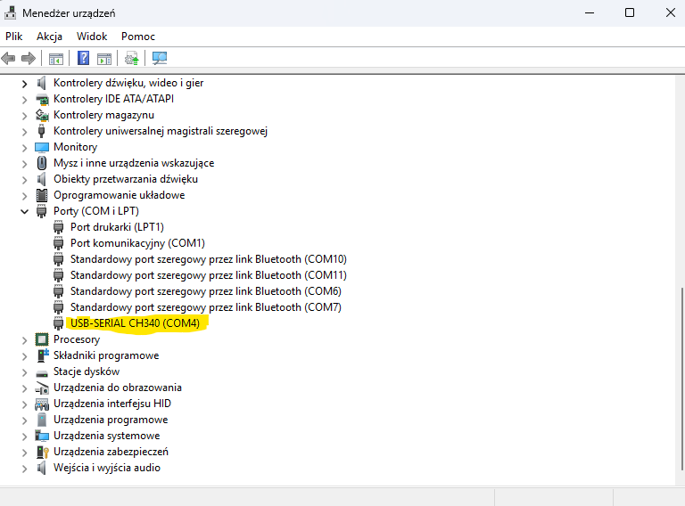

# Wstęp do Arduino

Arduino to jedna z najpopularniejszych platform do nauki elektroniki i programowania mikrokontrolerów.  
Jest tanie, proste i ma ogromną społeczność.

## Czym jest Arduino?

Arduino to:

- **płytki z mikrokontrolerem** (np. Arduino Uno, Nano, Mega),
- **środowisko Arduino IDE** – wgrywanie kodu jednym kliknięciem,
- **język podobny do C/C++** z uproszczonymi funkcjami (`setup()`, `loop()`),
- tysiące przykładów, poradników i gotowych bibliotek.

## Co trzeba mieć na start?

- Arduino Uno ,
- kabel USB,
- zainstalowane [**Arduino IDE**](https://www.arduino.cc/en/software/) lub [**Środowisko PlatformIO na VSCode**](https://platformio.org/) - choć w tym kursie skupimy się na Arduino IDE.

## Pierwszy program – migająca wbudowana dioda

> [!NOTE]
> 
> Wszystkie użyte tutaj bliblioteki (Arduino.h) są domyślnie zainstalowane przez Arduino IDE i PlatformIO.


```cpp
// dobra praktyka: dołączenie biblioteki Arduino
#include <Arduino.h>

// Funkcja która wykona się raz na początku programu
void setup() {
    // Mówimy mikrokontrolerowi, że pin wbudowanej diody - LED_BUILTIN to wyjście - OUTPUT
    pinMode(LED_BUILTIN, OUTPUT);
}

// Funkcja która wykona się w kółko co każdy cykl programu
void loop() {
    // ustawiamy diodę w stan wysoki (włączoną)
  digitalWrite(LED_BUILTIN, HIGH);
    // czekamy pół sekundy
  delay(500);
    // ustawiamy diodę w stan niski (wyłączoną)
  digitalWrite(LED_BUILTIN, LOW);
    // czekamy pół sekundy
  delay(500);
}
```


Teraz:
1. Podłącz Arduino do komputera kablem USB.
2. Otwórz Arduino IDE.
3. Wklej powyższy kod do nowego szkicu.
4. Wybierz odpowiednią płytkę i port w menu `Narzędzia` > `Płytka` i `Port`.
5. Kliknij przycisk `Wgraj` (strzałka w prawo).
6. Po chwili dioda na płytce Arduino powinna zacząć migać co pół sekundy!

> [!TIP]
> 
> *Co jeżeli nie wiem jaki port wybrać?*
> 
> Aby na Windowsie sprawdzić, który port COM jest używany przez Arduino:
> 1. Otwórz `Menedżer urządzeń` (Device Manager).
> 2. Rozwiń sekcję `Porty (COM i LPT)` (Ports (COM & LPT)).
> 3. Podłącz Arduino do komputera.
> 4. Obserwuj, który port pojawia się na liście – to będzie port Twojego Arduino (np. COM3, COM4).
> 5. Wybierz ten port w Arduino IDE pod `Narzędzia` > `Port`.
> 
> 


# Podsumowanie
Gratulacje! Udało Ci się wgrać swój pierwszy program na Arduino, który miga wbudowaną diodą.
W dalszej części kursu nauczysz się jak podłączać różne komponenty i pisać bardziej zaawansowane programy.


