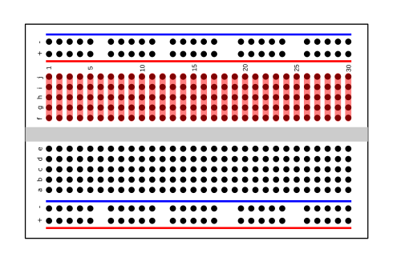
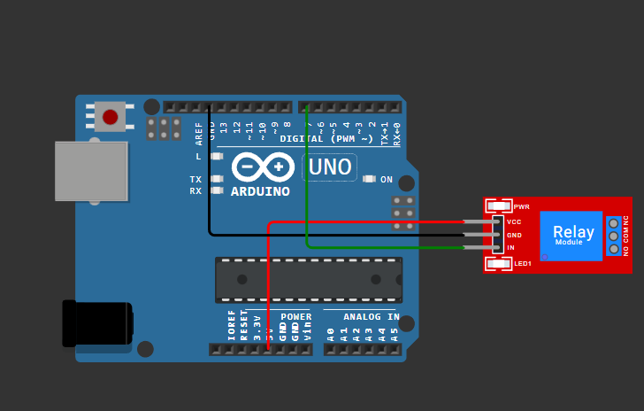
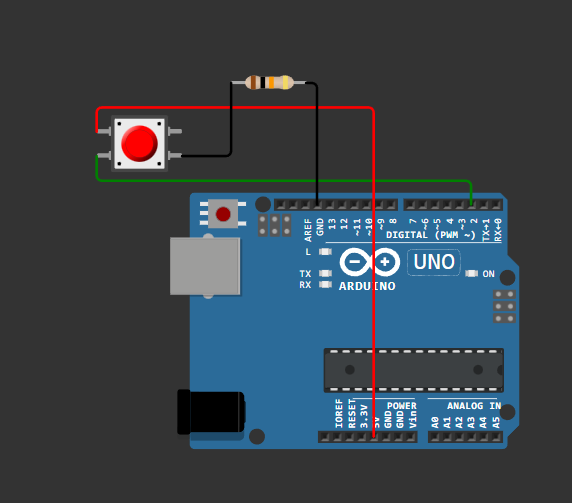
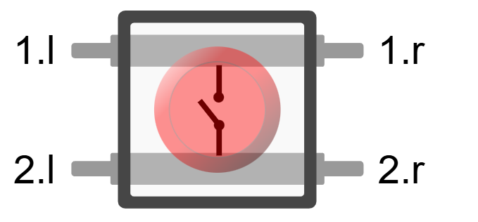
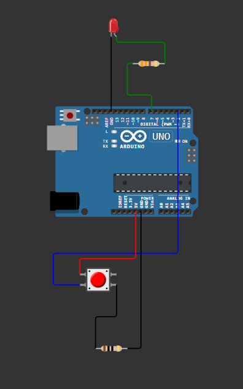
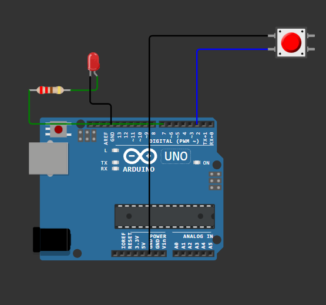

# Piny wejścia wyjścia
W tym rozdziale dowiesz się jak korzystać z pinów GPIO (General Purpose Input/Output) w Arduino.
To co zrobiliśmy w poprzednim rozdziale było już użyciem pinów GPIO – wbudowana dioda LED jest podłączona do jednego z nich, a dokładnie w przypadku Arduino Uno pod stałą `LED_BUILTIN` jest przypisany pin 13. Ale teraz nauczymy się jak korzystać z dowolnych pinów.

## Co to są piny GPIO?
Piny GPIO to uniwersalne piny na płytce Arduino, które mogą być skonfigurowane jako wejścia lub wyjścia cyfrowe. Możemy ich używać do odczytywania stanów (np. przycisków) lub do sterowania urządzeniami (np. diodami LED, silnikami - choć z tym ostatnim trzeba uważać, bo mogą wymagać więcej prądu niż pin może dostarczyć).

## Zad 1 - miganie zewnętrznej diody LED
Będziemy potrzebować:
- diodę LED,
- rezystor 220-330Ω,
- płytkę stykową i przewody połączeniowe.

Podłącz diodę LED do pinu 7 Arduino przez rezystor (dłuższa nóżka diody to anoda, czyli plus, powinna iść do pinu 7, krótsza nóżka to katoda, czyli minus, powinna iść do GND przez rezystor).


Następnie użyj poniższego kodu, aby dioda migała:

```cpp
#include <Arduino.h>
void setup() {
    pinMode(7, OUTPUT); // Ustawiamy pin 7 jako wyjście
}
void loop() {
    digitalWrite(7, HIGH); // Włączamy diodę
    delay(500);            // Czekamy pół sekundy
    digitalWrite(7, LOW);  // Wyłączamy diodę
    delay(500);            // Czekamy pół sekundy
}
```
Niewiele się zmieniło w porównaniu do poprzedniego przykładu. Zamiast `LED_BUILTIN` używamy numeru pinu 7.

> [!TIP]
> 
> Możesz się zastanawiać dlaczego:
> - **potrzebujemy rezystora?**
> 
> Rezystor ogranicza prąd płynący przez diodę, zapobiegając jej uszkodzeniu. Bez rezystora dioda może pobierać zbyt dużo prądu z pinu Arduino, co może uszkodzić zarówno diodę, jak i mikrokontroler - po prostu fizyka.
> - **w ten sposób podłączamy na płytce stykowej?**
> 
> Na płytce stykowej rzędy połączone są poziomo, a kolumny pionowo. Dlatego podłączamy nóżki diody i rezystora do różnych rzędów, aby prąd mógł płynąć przez diodę i rezystor do GND.
> 


## zad 2 - sterowanie przełącznikiem relay
Możemy również użyć pinów GPIO do sterowania przekaźnikiem (relay module). Przekaźnik pozwala na włączanie i wyłączanie urządzeń o wyższym napięciu lub prądzie, niż może obsłużyć bezpośrednio pin Arduino. Czyli taki włącznik który jest sterowany przez Arduino.

Relay module zazwyczaj ma trzy piny do sterowania:
- VCC (zasilanie) - podłączamy do 5V na Arduino,
- GND (ziemia) - podłączamy do GND na Arduino,
- IN (sterowanie) - podłączamy do wybranego pinu GPIO na Arduino (np. pin 7).

Podłącz relay module zgodnie z powyższym opisem, a następnie użyj poniższego kodu, aby sterować przekaźnikiem:



```cpp
#include <Arduino.h>
void setup() {
    pinMode(7, OUTPUT); // Ustawiamy pin 7 jako wyjście
}
void loop() {
    digitalWrite(7, HIGH); // Włączamy przekaźnik
    delay(1000);           // Czekamy sekundę
    digitalWrite(7, LOW);  // Wyłączamy przekaźnik
    delay(1000);           // Czekamy sekundę
}
```
Teraz możesz podłączyć urządzenie np lampę do przekaźnika i zobaczyć jak Arduino może je włączać i wyłączać.

> [!TIP]
>
> **Co oznaczają NO NC COM na przekaźniku?**
> 
> - NO (Normally Open) - normalnie otwarty, czyli gdy przekaźnik jest wyłączony, ten styk jest odłączony.
> - NC (Normally Closed) - normalnie zamknięty, czyli gdy przekaźnik jest wyłączony, ten styk jest połączony z COM.
> - COM (Common) - wspólny styk, do którego podłączamy zasilanie urządzenia.

## Zad 3 - odczyt przycisku
Teraz nauczymy się ważnej rzeczy – jak odczytywać stan przycisku. Będziemy potrzebować:
- przycisk (tzw. tactile button),
- rezystor 10kΩ,
- płytkę stykową i przewody połączeniowe.

Podłącz przycisk do pinu 2 Arduino oraz do GND przez rezystor 10kΩ. Dodatkowo podłącz pin 2 do 5V (bezpośrednio, bez rezystora). Dzięki temu gdy przycisk nie jest wciśnięty, pin 2 będzie miał stan wysoki (5V) dzięki podciągnięciu przez rezystor, a gdy przycisk jest wciśnięty, pin 2 zostanie połączony z GND i będzie miał stan niski (0V).



Następnie użyj poniższego kodu, aby odczytywać stan przycisku:

```cpp
#include <Arduino.h>
void setup() {
    pinMode(2, INPUT); // Ustawiamy pin 2 jako wejście
}

void loop() {
    int buttonState = digitalRead(2); // Odczytujemy stan przycisku
    if (buttonState == LOW) {          // Jeśli przycisk jest wciśnięty
        // Tutaj możemy dodać kod, który wykona się po wciśnięciu przycisku
    }
}
```

> [!TIP]
> 
> **Dlaczego używamy rezystora podciągającego (pull-up)?**
> Rezystor podciągający zapewnia, że pin wejściowy ma stabilny stan wysoki, gdy przycisk nie jest wciśnięty. Bez niego pin mógłby "pływać" i odczytywać losowe wartości, co prowadziłoby do nieprzewidywalnego zachowania programu. Później w kursie pokażę jak używać wewnętrznych rezystorów podciągających dostępnych w mikrokontrolerach Arduino.

> [!TIP]
>
> **Dlaczego tak podłączamy przycisk?**
> 
> Podłączamy przycisk w ten sposób, aby zapewnić stabilne odczyty stanu. Gdy przycisk jest wciśnięty, pin 2 jest bezpośrednio połączony z GND, co daje stan niski (LOW). Gdy przycisk jest zwolniony, rezystor podciągający 10kΩ łączy pin 2 z 5V, co daje stan wysoki (HIGH). Dzięki temu unikamy "pływających" stanów na pinie wejściowym.
> 
> 


Jednak jak widać, w tym przykładzie nic się nie dzieje po wciśnięciu przycisku – to tylko odczyt stanu. W następnym zadaniu użyjemy tego stanu do sterowania diodą LED.

## zad 4 - połączenie przycisku z diodą LED
Teraz połączymy wszystko razem – użyjemy przycisku do sterowania diodą LED. Gdy przycisk jest wciśnięty, dioda LED powinna się zapalić, a gdy przycisk jest zwolniony, dioda powinna zgasnąć.

Potrzebujemy:
- diodę LED,
- rezystor 220-330Ω do diody,
- przycisk (tactile button),
- rezystor 10kΩ do przycisku,
- płytkę stykową i przewody połączeniowe.

Podłącz diodę LED do pinu 7 przez rezystor oraz przycisk do pinu 2 z rezystorem podciągającym, jak w poprzednich zadaniach.



Następnie użyj poniższego kodu:

```cpp
#include <Arduino.h>
void setup() {
    pinMode(7, OUTPUT); // Ustawiamy pin 7 jako wyjście (LED)
    pinMode(2, INPUT);  // Ustawiamy pin 2 jako wejście (przycisk)
}
void loop() {
    int buttonState = digitalRead(2); // Odczytujemy stan przycisku
    if (buttonState == LOW) {          // Jeśli przycisk jest wciśnięty
        digitalWrite(7, HIGH);         // Włączamy diodę LED
    } else {
        digitalWrite(7, LOW);          // Wyłączamy diodę LED
    }
}
```

Teraz, gdy naciśniesz przycisk, dioda LED powinna się zapalić, a gdy go zwolnisz, dioda powinna zgasnąć.


## Podciągnięcia wewnętrzne
W mikrokontrolerach Arduino dostępne są wewnętrzne rezystory podciągające, które można aktywować programowo. Dzięki temu nie musimy używać zewnętrznego rezystora podciągającego do przycisku.

Dzięki temu możemy uprościć nasz układ, podłączając przycisk bezpośrednio między pin wejściowy a GND.


Aby użyć wewnętrznego rezystora podciągającego, wystarczy zmienić konfigurację pinu wejściowego w funkcji `setup()`:

```cpp
#include <Arduino.h>
void setup() {
    pinMode(7, OUTPUT);          // Ustawiamy pin 7 jako wyjście (LED)
    pinMode(2, INPUT_PULLUP);    // Ustawiamy pin 2 jako wejście z wewnętrznym rezystorem podciągającym
}
void loop() {
    int buttonState = digitalRead(2); // Odczytujemy stan przycisku
    if (buttonState == LOW) {          // Jeśli przycisk jest wciśnięty
        digitalWrite(7, HIGH);         // Włączamy diodę LED
    } else {
        digitalWrite(7, LOW);          // Wyłączamy diodę LED
    }
}
```

**Podsumowanie**

W tym rozdziale nauczyliśmy się jak korzystać z pinów GPIO w Arduino do sterowania diodą LED, przekaźnikiem oraz odczytywania stanu przycisku. To podstawy, które są niezbędne do tworzenia bardziej zaawansowanych projektów z Arduino.
