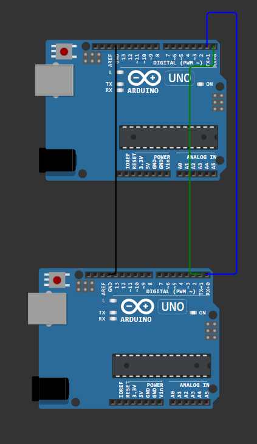

# Komunikacja szeregowa (Serial)
W tym rozdziale dowiesz się jak korzystać z komunikacji szeregowej w Arduino. Komunikacja szeregowa pozwala na wymianę danych między Arduino a komputerem lub innymi urządzeniami, co jest niezwykle przydatne do debugowania i monitorowania działania programu. 

## Co to jest komunikacja szeregowa?
Komunikacja szeregowa to sposób przesyłania danych jeden bit po drugim przez pojedynczy kanał komunikacyjny. W Arduino najczęściej korzystamy z interfejsu UART (Universal Asynchronous Receiver/Transmitter), który umożliwia komunikację z komputerem przez port USB. 

## Zad 1 - wysyłanie danych do monitora szeregowego
Będziemy potrzebować:
- Arduino Uno,
- kabel USB,

Podłącz Arduino do komputera za pomocą kabla USB. Następnie użyj poniższego kodu, aby wysyłać dane do monitora szeregowego:

```cpp
#include <Arduino.h>
void setup() {
    Serial.begin(9600); // Inicjalizujemy komunikację szeregową z prędkością 9600 bps
}
void loop() {
    Serial.println("Witaj w świecie Arduino!"); // Wysyłamy tekst zakończony znakiem \n do monitora szeregowego
    delay(1000); // Czekamy sekundę
}
```
Po wgraniu kodu na Arduino, otwórz Monitor Szeregowy w Arduino IDE (Narzędzia -> Monitor Szeregowy) i ustaw prędkość na 9600 bps. Powinieneś zobaczyć co sekundę pojawiający się tekst "Witaj w świecie Arduino!".

> [!WARNING]
>
> Upewnij się, że prędkość w Monitorze Szeregowym jest ustawiona na tę samą wartość, którą podałeś w `Serial.begin()`, w przeciwnym razie dane mogą być wyświetlane niepoprawnie.


## Zad 2 - odczytywanie danych z monitora szeregowego
Możemy również odczytywać dane wysyłane z komputera do Arduino. Użyj poniższego kodu, aby odczytywać dane z monitora szeregowego:

```cpp
#include <Arduino.h>
void setup() {
    Serial.begin(9600); // Inicjalizujemy komunikację szeregową z prędkością 9600 bps
}
void loop() {
    if (Serial.available() > 0) { // Sprawdzamy czy są dostępne dane do odczytu
        String dane = Serial.readStringUntil('\n'); // Odczytujemy dane aż do znaku nowej linii
        Serial.print("Otrzymano: "); // Wysyłamy potwierdzenie otrzymania danych
        Serial.println(dane);
    }
}
```

Tutaj zagłębimy się w dwie nowe funkcje:
- `Serial.available()` - sprawdza ile bajtów danych jest dostępnych do odczytu. Czyli ile danych czeka na nas w buforze.
- `Serial.readStringUntil('\n')` - odczytuje dane z bufora aż do napotkania znaku nowej linii (`\n`). Dzięki temu możemy wysyłać całe linie tekstu z komputera do Arduino.

Po wgraniu kodu na Arduino, otwórz Monitor Szeregowy w Arduino IDE, ustaw prędkość na 9600 bps i wpisz dowolny tekst w polu wejściowym na dole Monitora Szeregowego, a następnie naciśnij Enter. Arduino powinno odpowiedzieć, wyświetlając "Otrzymano: " wraz z wysłanym tekstem.

> [!TIP]
> 
> **Ciekawostka:**
>
> Komunikacja szeregowa pozwala na łatwe przesyłanie danych między różnymi urządzeniami czyli np. dwoma mikrokontrolerami lub innymi modułami (np. moduł GPS, moduł Bluetooth itp.). Możesz zastanawiać jak to zrobić? Nic bardziej prostego! Na płytce Arduino Uno znajdziesz piny oznaczone jako RX (odbiór) i TX (nadawanie). Możesz podłączyć pin TX jednego urządzenia do pinu RX drugiego i odwrotnie, aby umożliwić komunikację między nimi.
> 
> 
>
> **Pamiętaj**: Aby mieć poprawną komunikację, oba urządzenia muszą działać na tej samej prędkości transmisji (baud rate) oraz muszą mieć wspólną masę (punkt odniesienia napiecia).

## Podsumowanie
Komunikacja szeregowa to potężne narzędzie w arsenale Arduino, które umożliwia wymianę danych między Arduino a komputerem lub innymi urządzeniami. Dzięki niej możemy łatwo debugować nasze programy, monitorować działanie czujników oraz sterować różnymi modułami. W kolejnych rozdziałach poznasz również inne metody komunikacji, takie jak I2C czy SPI, które pozwolą Ci na jeszcze bardziej zaawansowane projekty z Arduino.