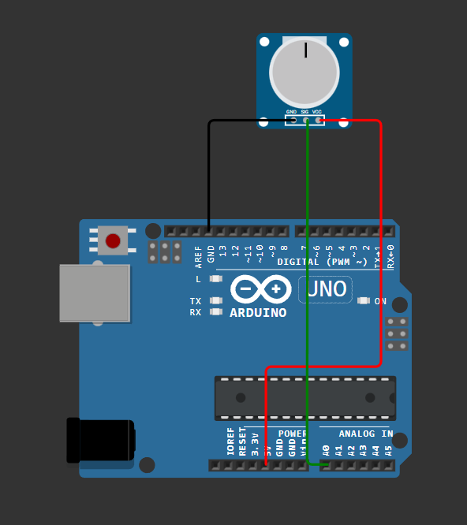
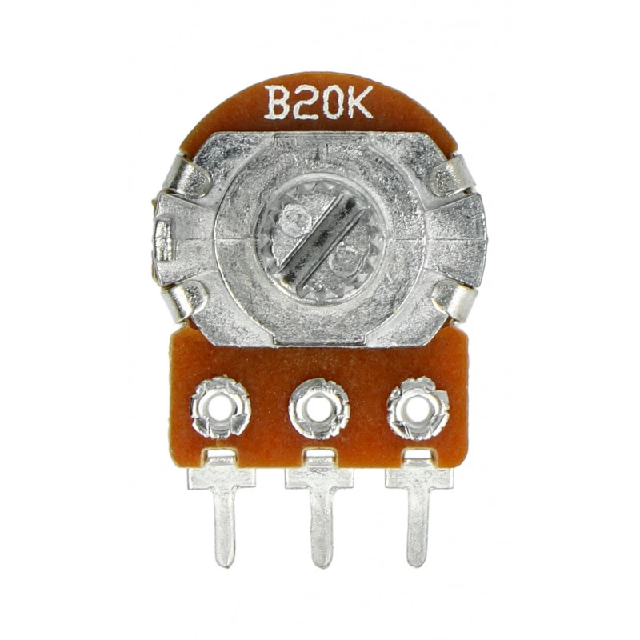
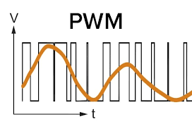
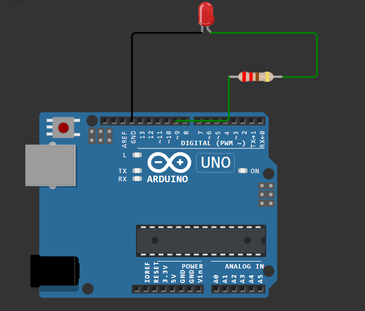

# Inne piny specjalne
W tym rozdziale omówimy inne specjalne piny dostępne na płytkach Arduino, takie jak piny analogowe, piny PWM oraz piny komunikacyjne (I2C, SPI, UART).
Nie ukrywajmy, że te tematy są bardziej zaawansowane, ale są one kluczowe dla wielu projektów z Arduino. Więc zanurzmy się w te zagadnienia!

## Piny analogowe
Piny analogowe na Arduino (oznaczone jako A0, A1, A2, itd.) pozwalają na odczyt wartości analogowych, czyli takich, które mogą przyjmować różne wartości w określonym zakresie (zazwyczaj od 0 do 1023 dla Arduino Uno). Używają one przetwornika analogowo-cyfrowego (ADC) do konwersji napięcia na wartość cyfrową.
Możemy ich używać do odczytu sygnałów z czujników, takich jak potencjometry, czujniki światła czy temperatury.

### Zad 1 - odczyt wartości z potencjometru
Będziemy potrzebować:
- potencjometr obrotowy (np. 10kΩ),
- płytkę stykową i przewody połączeniowe.

Podłącz potencjometr w następujący sposób:
- jedna nóżka do 5V na Arduino,
- druga nóżka do GND na Arduino,
- środkowa nóżka (suwak) do pinu A0 na Arduino.



> [!TIP]
> 
> W przypadku potencjometru obrotowego bez oznaczeń, podłącz środkową nóżkę do pinu A0, a pozostałe dwie nóżki do 5V i GND (kolejność bocznych nóżek nie ma znaczenia) - zmienia to tylko kierunek obrotu.
> 
> 

Następnie użyj poniższego kodu, aby odczytać wartość z potencjometru i wyświetlić ją w monitorze szeregowym:

```cpp
#include <Arduino.h>
void setup() {
    Serial.begin(9600); // Inicjalizujemy komunikację szeregową
}
void loop() {
    int wartosc = analogRead(A0); // Odczytujemy wartość z pinu A0
    Serial.print("Wartość z potencjometru: "); 
    Serial.println(wartosc); // Wysyłamy wartość do monitora szeregowego
    delay(500); // Czekamy pół sekundy
}
```

Po wgraniu kodu na Arduino, otwórz Monitor Szeregowy w Arduino IDE i ustaw prędkość na 9600 bps. Obracając potencjometr, powinieneś zobaczyć zmieniające się wartości od 0 do 1023.

>[!NOTE]
> 
> **Dlaczego zakres od 0 do 1023?**
> 
> Arduino Uno używa 10-bitowego przetwornika analogowo-cyfrowego (ADC), co oznacza, że może reprezentować 1024 różne poziomy napięcia (2^10 = 1024). Dlatego odczyty z pinów analogowych mieszczą się w zakresie od 0 (0V - wartość odniesienia masy) do 1023 (5V - wartość wysoka w arduino uno). Łącznie daje to 1024 poziomy napięcia.


## Piny PWM (Pulse Width Modulation)
PWM to wbrew pozorom bardzo ciekawe zagadnienie. Pozwala na symulację sygnału analogowego za pomocą sygnału cyfrowego poprzez szybkie włączanie i wyłączanie pinu. Dzięki temu możemy sterować jasnością diod LED, prędkością silników czy innymi urządzeniami.

### Jak to w praktyce działa?
Sygnał PWM składa się z cykli, gdzie pin jest w stanie wysokim (ON) przez określony czas, a następnie w stanie niskim (OFF) przez resztę cyklu. Procent czasu, przez który pin jest w stanie wysokim, nazywamy współczynnikiem wypełnienia (duty cycle). Na przykład:
- 0% duty cycle: pin jest zawsze wyłączony (LOW),
- 50% duty cycle: pin jest włączony przez połowę czasu i wyłącz przez połowę czasu,
- 100% duty cycle: pin jest zawsze włączony (HIGH).


### Ale jak to jest że symuluje analog?
Dzięki szybkiemu przełączaniu między stanami HIGH i LOW, urządzenia takie jak diody LED czy silniki odbierają sygnał PWM jako średnie napięcie. Na przykład, jeśli dioda LED otrzymuje sygnał PWM z 50% duty cycle, to wydaje się, że jest zasilana napięciem około połowy maksymalnego napięcia (np. około 2.5V przy 5V zasilaniu), co powoduje, że świeci z połową swojej jasności.



> [!NOTE]
>
> **Na których pinach mogę używać PWM?**
> 
> Na Arduino Uno piny obsługujące PWM są oznaczone symbolem "~" obok numeru pinu. Są to piny: 3, 5, 6, 9, 10 i 11. 
> Inne niestety nie obsługują PWM.


### Zad 2 - sterowanie jasnością diody LED za pomocą PWM

Będziemy potrzebować:
- diodę LED,
- rezystor 220Ω,
- płytkę stykową i przewody połączeniowe.

Podłącz diodę LED do pinu 9 Arduino przez rezystor 220Ω, tak jak w poprzednich przykładach.



Następnie użyj poniższego kodu, aby ustawić jasność diody LED na 50% za pomocą PWM:

```cpp
#include <Arduino.h>
void setup() {
    pinMode(9, OUTPUT); // Ustawiamy pin 9 jako wyjście
}
void loop() {
    analogWrite(9, 128); // Ustawiamy jasność diody LED na 50% (wartość od 0 do 255)
    delay(1000);         // Czekamy sekundę
}

```

Zagłębmy się w funkcję `analogWrite(pin, value)`:
- `pin` - numer pinu, na którym chcemy ustawić sygnał PWM (np. 9),
- `value` - wartość od 0 do 255, gdzie 0 oznacza 0% duty cycle (pin zawsze LOW), a 255 oznacza 100% duty cycle (pin zawsze HIGH). Wartość 128 ustawia pin na około 50% duty cycle.


Po wgraniu kodu na Arduino, dioda LED powinna świecić z połową swojej maksymalnej jasności.

> [!TIP]
> 
> **Eksperymentuj z jasnością!**
> 
> Możesz zmieniać wartość w `analogWrite(9, value)` na różne liczby od 0 do 255, aby zobaczyć jak zmienia się jasność diody LED. Na przykład:
> - `analogWrite(9, 0);` - dioda wyłączona,
> - `analogWrite(9, 64);` - dioda świeci słabo,
> - `analogWrite(9, 192);` - dioda świeci jasno,
> - `analogWrite(9, 255);` - dioda świeci maksymalnie jasno.


## Piny komunikacyjne (I2C, SPI, UART)
Tutaj zaczyna się prawdziwa zabawa!
Arduino obsługuje różne protokoły komunikacyjne, które pozwalają na wymianę danych z innymi urządzeniami, takimi jak czujniki, moduły czy inne mikrokontrolery. Najpopularniejsze z nich to I2C, SPI i UART (UART omówiliśmy już wcześniej w kontekście komunikacji szeregowej).

### I2C (Inter-Integrated Circuit)
I2C to protokół komunikacyjny, który pozwala na podłączenie wielu urządzeń do dwóch wspólnych linii: SDA (dane) i SCL (zegar). Każde urządzenie ma unikalny adres, co umożliwia komunikację z wieloma urządzeniami na tych samych liniach. 
Np. czujnik temperatury, wyświetlacz LCD czy moduł RTC (Real Time Clock) mogą być podłączone do tych samych pinów SDA i SCL. 

Na Arduino Uno piny I2C to:
- SDA: A4
- SCL: A5

### SPI (Serial Peripheral Interface)
SPI to szybki protokół komunikacyjny, który używa czterech linii do komunikacji między urządzeniami:
- MOSI (Master Out Slave In) - linia danych z mastera do slave'a,
- MISO (Master In Slave Out) - linia danych ze slave'a do mastera
- SCK (Serial Clock) - linia zegara,
- SS (Slave Select) - linia wyboru slave'a.

Na Arduino Uno piny SPI to:
- MOSI: 11
- MISO: 12
- SCK: 13
- SS: 10 (może być używany jako dowolny pin cyfrowy)

### UART (Universal Asynchronous Receiver/Transmitter)
UART to protokół komunikacyjny używany do asynchronicznej wymiany danych między dwoma urządzeniami. W Arduino Uno piny UART to:
- RX (odbiór): pin 0
- TX (nadawanie): pin 1


**Te protokoły komunikacyjne są szeroko stosowane w projektach Arduino, umożliwiając łatwą integrację z różnorodnymi modułami i czujnikami. W kolejnych rozdziałach omówimy, jak korzystać z tych protokołów w praktyce.**


## Podsumowanie
W tym rozdziale omówiliśmy piny analogowe, piny PWM oraz podstawy protokołów komunikacyjnych I2C, SPI i UART. Te funkcje rozszerzają możliwości Arduino, pozwalając na bardziej zaawansowane projekty i integrację z różnorodnymi urządzeniami.
