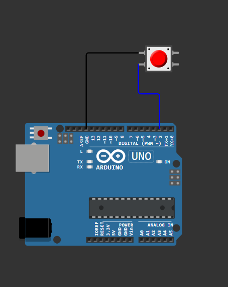

# Zagłębmy się dalej w Arduino
W tym rozdziale skupimy się na rzeczach, bardziej zaawansowanych, których nie zawarłem we wcześniejszych rozdziałach. Omówimy tutaj kilka ważnych aspektów działania Arduino, które pomogą Ci lepiej zrozumieć jak działa ta platforma.

## ATmega
Płytka arduino opiera się na mikrokontrolerze - najczęściej jest to **ATmega328P** (Arduino Uno). Mikrokontroler to mały komputer na jednej układzie scalonym, który zawiera procesor, pamięć i peryferia do komunikacji z innymi urządzeniami. Mikrokontroler zarządza wszystkimi operacjami na płytce Arduino, w tym odczytem i zapisem danych na pinach cyfrowych i analogowych, komunikacją szeregową, obsługą przerwań i wiele więcej. I tak na prawdę właśnie ten mały chip w środku jest sercem całego Arduino, a reszta to tylko wyprowadzenia i układy pomocnicze.

## Pamięć
Mikrokontrolery mają różne rodzaje pamięci:
- **Flash** - pamięć nieulotna, w której przechowywany jest kod programu. W przypadku ATmega328P jest to 32KB.
- **SRAM** - pamięć ulotna, używana do przechowywania zmiennych podczas działania programu. W ATmega328P jest to 2KB.
- **EEPROM** - pamięć nieulotna, używana do przechowywania danych, które muszą być zachowane po wyłączeniu zasilania. W ATmega328P jest to 1KB.

## Przerwania
Przerwania to specjalne sygnały, które mogą przerwać normalne wykonywanie programu i wymusić natychmiastowe wykonanie określonej funkcji (tzw. obsługi przerwania). Przerwania są używane do obsługi zdarzeń zewnętrznych, takich jak naciśnięcie przycisku, odbiór danych z czujnika czy sygnały zegarowe. Dzięki przerwaniom program może reagować na zdarzenia w czasie rzeczywistym, bez konieczności ciągłego sprawdzania stanu pinów (tzw. "polling").

Będziemy potrzebować:
- przycisk (tactile button),
- płytkę stykową i przewody połączeniowe.

Podłącz przycisk do pinu 2 Arduino oraz do GND.



Następnie użyj poniższego kodu, aby obsłużyć przerwanie wywołane naciśnięciem przycisku:

```cpp
#include <Arduino.h>
void handleInterrupt() {
    // Ta funkcja wykona się po naciśnięciu przycisku
    Serial.println("Przycisk wciśnięty!");
}
void setup() {
    Serial.begin(9600); // Inicjalizujemy komunikację szeregową
    pinMode(2, INPUT_PULLUP); // Ustawiamy pin 2 jako wejście z wewnętrznym rezystorem podciągającym
    attachInterrupt(digitalPinToInterrupt(2), handleInterrupt, FALLING); // Konfigurujemy przerwanie na pinie 2
}
void loop() {
    // Główna pętla programu może być pusta
}
```

> [!NOTE]
> 
> **Jak to działa?**
> 
> `attachInterrupt(digitalPinToInterrupt(2), handleInterrupt, FALLING);` - ta linia konfiguruje przerwanie na pinie 2. Gdy stan pinu zmieni się z wysokiego na niski (FALLING), zostanie wywołana funkcja `handleInterrupt()`.

Po wgraniu kodu na Arduino, otwórz Monitor Szeregowy w Arduino IDE i ustaw prędkość na 9600 bps. Gdy naciśniesz przycisk, powinieneś zobaczyć komunikat "Przycisk wciśnięty!" w monitorze szeregowym.
Więcej o przerwaniach i ich zastosowaniach znajdziesz w dokumentacji Arduino: [Arduino - Interrupts](https://docs.arduino.cc/language-reference/en/functions/external-interrupts/attachInterrupt/).

## Podsumowanie
W tym rozdziale omówiliśmy kilka zaawansowanych aspektów działania Arduino. Jednak głębsze zrozumienie systemów wbudowanych i mikrokontrolerów wymaga dalszej nauki i praktyki. Których nie sposób omówić w tym kursie.

Mam nadzieję, że te informacje pomogą Ci lepiej zrozumieć jak działa Arduino i zachęcą do dalszej eksploracji tej fascynującej platformy!
A teraz zapraszam Cię do kolejnego rozdziału, gdzie poznamy inną płytkę - ESP!