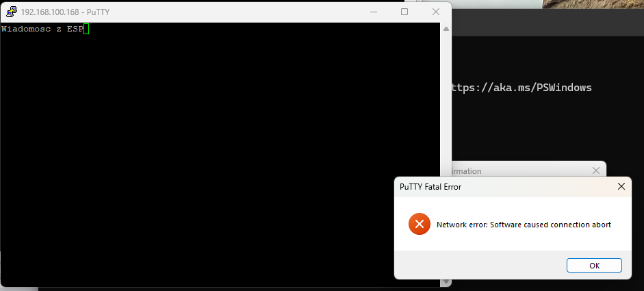

# Komunikacja sieciowa

W poprzednim rozdziale nauczyliśmy się, w jaki sposób podłączyć naszą płytkę do
sieci WiFi. Teraz nadszedł czas, aby coś przez tę sieć przesłać. W tym rozdziale
dowiesz się jak stworzyć prostą komunikację sieciową z komputerem.

> [!NOTE]
>
> Oprócz płytki ESP8266 lub ESP32 oraz komputera z Arduino IDE będziemy
> potrzebować jakiegoś narzędzia do komunikowania się z naszą płytką. W tym celu
> polecam
> [PuTTY](https://www.chiark.greenend.org.uk/~sgtatham/putty/latest.html), który
> jest darmowy i łatwy w użyciu.

## Prosty serwer WWW na ESP

Pierwszym krokiem w naszej przygodzie z komunikacją sieciową będzie stworzenie
prostego serwera sieciowego, który będzie czekał na połączenia od klienta i
odsyłał "Wiadomosc z ESP".

1. Dołączamy odpowiednie biblioteki.

```cpp
#include <Arduino.h>
#include <WiFi.h> // Dla ESP32
// #include <ESP8266WiFi.h> // Dla ESP8266
```

2. Definiujemy nazwę sieci (SSID) oraz hasło do niej.

```cpp
const char* ssid = "Twoja_Siec_WiFi";
const char* passwd = "Twoje_Haslo_WiFi";
```

3. Tworzymy obiekt serwera na porcie 123

```cpp
WiFiServer server(1234);
```

4. W funkcji `setup()` łączymy się z siecią WiFi i uruchamiamy serwer.

```cpp
void setup() {
  Serial.begin(115200); // Inicjalizacja portu szeregowego na prędkość 115200 bps
  WiFi.begin(ssid, passwd); // Łączenie z siecią WiFi

  while (WiFi.status() != WL_CONNECTED) {
    delay(1000);
    Serial.println("Łączenie z siecią WiFi...");
  }

  Serial.println("Połączono z siecią WiFi!");
  Serial.print("Adres IP: ");
  Serial.println(WiFi.localIP()); // Wyświetlenie przydzielonego adresu IP

  server.begin(); // Uruchomienie serwera
}
```

5. W funkcji `loop()` czekamy na połączenia od klientów i odsyłamy im wiadomość.

```cpp
void loop() {
  WiFiClient client = server.available(); // Sprawdzamy czy jest dostępny klient

  if (client) { // Jeśli klient się połączył
    Serial.println("Nowe połączenie od klienta");
    client.println("Wiadomosc z ESP"); // Wysyłamy wiadomość do klienta
    delay(10); // Krótkie opóźnienie, aby upewnić się, że dane zostały wysłane
    client.stop(); // Zamykanie połączenia z klientem
    Serial.println("Połączenie zamknięte");
  }
}
```

Po wgraniu kodu na płytkę ESP otwórz PuTTY i połącz się z adresem IP
wyświetlonym w Monitorze Szeregowym, używając portu 1234. Powinieneś zobaczyć
wiadomość "Wiadomosc z ESP". I od razu połączenie zostanie zamknięte.

