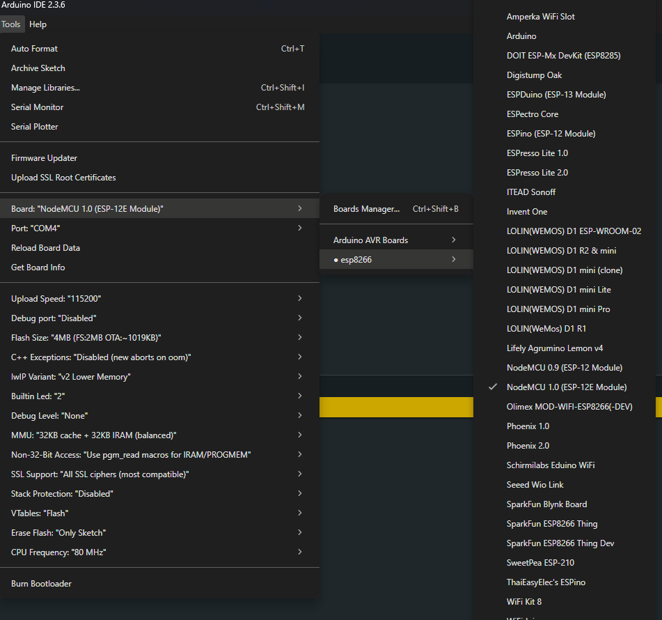

# Wprowadzenie do ESP

## Czym jest ESP?

ESP to rodzina mikrokontrolerów z wbudowanym modułem Wi-Fi, które są szeroko stosowane w projektach IoT (Internet of
Things). Najpopularniejsze modele to ESP8266 i ESP32. Dzięki nim możesz tworzyć urządzenia, które komunikują się z
internetem lub innymi urządzeniami bezprzewodowo.

## Dlaczego warto używać ESP?
- Wbudowane Wi-Fi: Umożliwia łatwe połączenie z siecią bezprzewodową.
- Niska cena: ESP są bardzo tanie w porównaniu do innych mikrokontrolerów z podobnymi funkcjami.
- Duża społeczność: Istnieje wiele zasobów, bibliotek i przykładów dostępnych online.
- Wsparcie dla Arduino IDE: Możesz programować ESP za pomocą Arduino IDE, co ułatwia naukę i rozwój projektów.
- Wielofunkcyjność: ESP32 oferuje również Bluetooth, co rozszerza możliwości komunikacji. (Trzeba jednak pamiętać, że np ESP8266 już nie posiada tej funkcji.)

## Podstawowe kroki konfiguracji ESP w Arduino IDE
Zanim zaczniemy programować ESP, musimy skonfigurować środowisko i niestety jest to trochę bardziej skomplikowane niż w przypadku Arduino Uno.

1. **Zainstaluj Arduino IDE**: Upewnij się, że masz zainstalowaną najnowszą wersję Arduino IDE. Możesz ją pobrać z oficjalnej strony Arduino.
2. **Dodaj obsługę ESP do Arduino IDE**:
   - Otwórz Arduino IDE i przejdź do `Plik` -> `Preferencje`.
   - W polu `Dodatkowe adresy URL do menedżera płytek` dodaj następujący link:
     - Dla ESP8266: `http://arduino.esp8266.com/stable/package_esp8266com_index.json`
     - Dla ESP32: `https://dl.espressif.com/dl/package_esp32_index.json`
   - Kliknij `OK`, aby zapisać zmiany.
3. **Zainstaluj pakiet płytek ESP**:
   - Przejdź do `Narzędzia` -> `Płytka` -> `Menedżer płytek`.
   - Wyszukaj `ESP8266` lub `ESP32` i zainstaluj odpowiedni pakiet.
4. **Wybierz odpowiednią płytkę ESP**:
    - Przejdź do `Narzędzia` -> `Płytka` i wybierz swoją płytkę ESP (np. `NodeMCU 1.0 (ESP-12E Module)` dla ESP8266 lub `ESP32 Dev Module` dla ESP32).
   

5. **Podłącz ESP do komputera**: Użyj kabla USB, aby podłączyć płytkę ESP do komputera. **Upewnij się, że masz zainstalowane odpowiednie sterowniki, jeśli to konieczne.**
6. **Wybierz port COM**:
   - Przejdź do `Narzędzia` -> `Port` i wybierz odpowiedni port COM, do którego podłączona jest płytka ESP.
   - Jeśli nie widzisz swojego ESP na liście portów, upewnij się, że sterowniki są poprawnie zainstalowane.
   - Na Windowsie możesz sprawdzić port w `Menedżerze urządzeń` pod `Porty (COM i LPT)`.
   - Na macOS i Linuxie porty zazwyczaj wyglądają jak `/dev/ttyUSB0` lub `/dev/cu.SLAB_USBtoUART`.

> [!WARNING]
> 
> Niektóre płytki ESP wymagają odpowiedniego sterownika USB-to-Serial, takiego jak CP2102 lub CH340. Upewnij się, że masz zainstalowane odpowiednie sterowniki dla swojej płytki.
> Czasami może się okazać, że domyślnie instalowany sterownik przez system operacyjny nie działa poprawnie i trzeba ręcznie zainstalować właściwy sterownik ze strony producenta.
> Dlatego warto poszukać informacji na temat swojej konkretnej płytki ESP i sprawdzić, czy są dostępne dedykowane sterowniki.

> [!NOTE]
> 
> W tym kursie będę korzystał z płytki ESP32 C3 Super Mini - kompaktowej płytki z ESP32 C3, która jest popularna ze względu na swój mały rozmiar i ma wbudowane Wi-Fi oraz Bluetooth. Jednak większość przykładów będzie działać również na innych płytkach ESP32 lub ESP8266 z minimalnymi zmianami.
